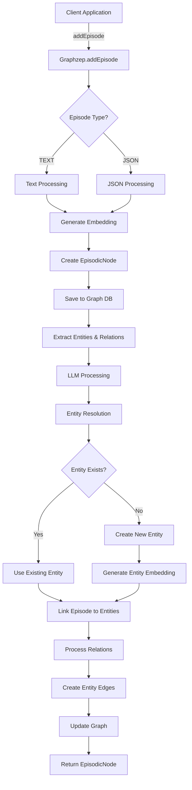
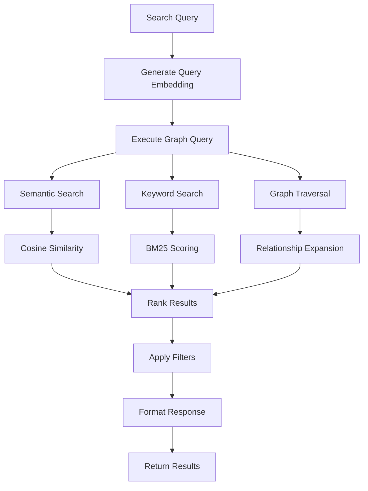
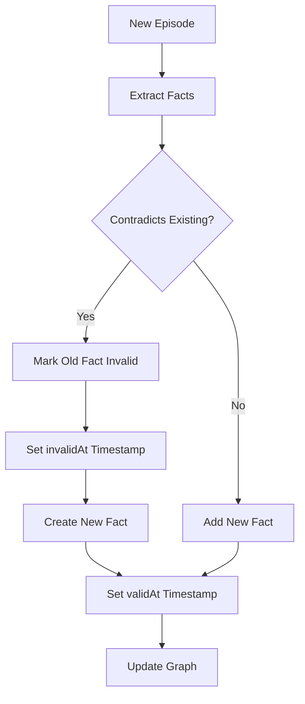

# Data Flow and Processing Pipeline

## Overview

This document describes how data flows through Graphzep from initial ingestion to final storage and retrieval. Understanding this flow is crucial for extending the system or debugging issues.

## Episode Ingestion Flow



## Detailed Processing Steps

### 1. Episode Reception

When `addEpisode` is called, the system receives:

```typescript
interface AddEpisodeParams {
  content: string;              // Text or JSON string
  episodeType?: EpisodeType;    // TEXT or JSON
  referenceId?: string;         // External reference
  groupId?: string;             // Data isolation group
  metadata?: Record<string, any>;
}
```

**Processing:**
1. Validate input parameters
2. Assign groupId (use default if not provided)
3. Determine episode type
4. Prepare for processing

### 2. Content Embedding

The content is converted to a vector embedding for semantic search:

```typescript
// Generate embedding for the entire content
const embedding = await this.embedder.embed(params.content);

// For large content, may use summary
const summary = content.length > 1000 
  ? await this.summarize(content)
  : content;
const embedding = await this.embedder.embed(summary);
```

**Embedding Process:**
- Text normalization and cleaning
- Token limit management (8191 tokens max)
- API call to embedding service
- Vector normalization

### 3. EpisodicNode Creation

Create a node representing the episode:

```typescript
const episodicNode = new EpisodicNodeImpl({
  uuid: generateUUID(),
  name: content.substring(0, 50),  // First 50 chars
  groupId: groupId,
  episodeType: episodeType,
  content: content,
  embedding: embedding,
  validAt: new Date(),           // When episode occurred
  referenceId: referenceId,
  labels: ['Episodic'],
  createdAt: new Date()
});

await episodicNode.save(this.driver);
```

**Database Operation:**
```cypher
MERGE (n:Episodic {uuid: $uuid})
SET n.name = $name,
    n.content = $content,
    n.embedding = $embedding,
    n.validAt = datetime($validAt),
    n.groupId = $groupId
RETURN n
```

### 4. Entity and Relation Extraction

The LLM analyzes content to extract structured information:

```typescript
const extractedData = await this.extractEntitiesAndRelations(content);
// Returns: { entities: ExtractedEntity[], relations: ExtractedRelation[] }
```

**LLM Prompt Structure:**
```
Extract entities and relationships from the following text.

Instructions:
1. Identify all entities (people, places, organizations, concepts)
2. For each entity provide: name, entityType, summary
3. Identify relationships between entities
4. For each relationship provide: sourceName, targetName, relationName

Text: [CONTENT]

Respond with JSON: { entities: [...], relations: [...] }
```

**Example Extraction:**
```json
{
  "entities": [
    {
      "name": "Kamala Harris",
      "entityType": "Person",
      "summary": "Attorney General of California"
    },
    {
      "name": "California",
      "entityType": "Place",
      "summary": "U.S. state on the west coast"
    }
  ],
  "relations": [
    {
      "sourceName": "Kamala Harris",
      "targetName": "California",
      "relationName": "serves as Attorney General of"
    }
  ]
}
```

### 5. Entity Resolution and Creation

For each extracted entity, determine if it already exists:

```typescript
private async processExtractedEntities(
  entities: ExtractedEntity[],
  groupId: string
): Promise<EntityNodeImpl[]> {
  const processedEntities: EntityNodeImpl[] = [];
  
  for (const entity of entities) {
    // Check for existing entity by name and group
    const existing = await this.findExistingEntity(entity.name, groupId);
    
    if (existing) {
      // Use existing entity
      processedEntities.push(existing);
    } else {
      // Create new entity with embedding
      const embedding = await this.embedder.embed(entity.summary);
      
      const entityNode = new EntityNodeImpl({
        uuid: generateUUID(),
        name: entity.name,
        groupId: groupId,
        entityType: entity.entityType,
        summary: entity.summary,
        summaryEmbedding: embedding,
        labels: ['Entity'],
        createdAt: new Date()
      });
      
      await entityNode.save(this.driver);
      processedEntities.push(entityNode);
    }
  }
  
  return processedEntities;
}
```

**Entity Resolution Query:**
```cypher
MATCH (n:Entity {name: $name, groupId: $groupId})
RETURN n LIMIT 1
```

### 6. Episode-Entity Linking

Create edges connecting the episode to its entities:

```typescript
private async linkEpisodeToEntities(
  episode: EpisodicNode,
  entities: EntityNodeImpl[]
): Promise<void> {
  for (const entity of entities) {
    const edge = new EpisodicEdgeImpl({
      uuid: generateUUID(),
      sourceId: episode.uuid,
      targetId: entity.uuid,
      groupId: episode.groupId,
      createdAt: new Date()
    });
    
    await edge.save(this.driver);
  }
}
```

**Link Creation Query:**
```cypher
MATCH (e:Episodic {uuid: $episodeId}), (n:Entity {uuid: $entityId})
CREATE (e)-[:MENTIONS]->(n)
```

### 7. Relation Processing

Create edges between entities based on extracted relationships:

```typescript
private async processExtractedRelations(
  relations: ExtractedRelation[],
  entities: EntityNodeImpl[],
  groupId: string
): Promise<void> {
  for (const relation of relations) {
    // Find source and target entities
    const source = entities.find(e => e.name === relation.sourceName);
    const target = entities.find(e => e.name === relation.targetName);
    
    if (source && target) {
      // Generate fact description
      const fact = `${source.name} ${relation.relationName} ${target.name}`;
      const factEmbedding = await this.embedder.embed(fact);
      
      const edge = new EntityEdgeImpl({
        uuid: generateUUID(),
        sourceName: source.name,
        targetName: target.name,
        relationName: relation.relationName,
        fact: fact,
        factEmbedding: factEmbedding,
        episodeIds: [episode.uuid],
        validAt: episode.validAt,
        groupId: groupId,
        createdAt: new Date()
      });
      
      await edge.save(this.driver);
    }
  }
}
```

**Relation Creation Query:**
```cypher
MATCH (s:Entity {name: $sourceName}), (t:Entity {name: $targetName})
CREATE (s)-[r:RELATES_TO {
  name: $relationName,
  fact: $fact,
  factEmbedding: $factEmbedding,
  validAt: datetime($validAt)
}]->(t)
```

## Search and Retrieval Flow



### Search Processing Steps

1. **Query Embedding Generation**
```typescript
const embedding = await this.embedder.embed(params.query);
```

2. **Similarity Search Execution**
```typescript
const query = `
  MATCH (n)
  WHERE n.groupId = $groupId
    AND n.embedding IS NOT NULL
  WITH n, 
    reduce(similarity = 0.0, i IN range(0, size(n.embedding)-1) | 
      similarity + (n.embedding[i] * $embedding[i])
    ) AS similarity
  ORDER BY similarity DESC
  LIMIT $limit
  RETURN n, labels(n) as labels
`;
```

3. **Result Processing**
```typescript
return results.map((result) => {
  const nodeData = result.n;
  const labels = result.labels;
  
  if (labels.includes('Entity')) {
    return new EntityNodeImpl(nodeData);
  } else if (labels.includes('Episodic')) {
    return new EpisodicNodeImpl(nodeData);
  }
  // ... handle other node types
});
```

## Update and Invalidation Flow

When new information contradicts existing facts:



### Temporal Update Process

1. **Detect Contradictions**
```typescript
// Find existing facts about the same entities
const existingFacts = await this.findRelatedFacts(source, target);

// Check for contradictions
for (const fact of existingFacts) {
  if (this.contradictsNewFact(fact, newFact)) {
    // Mark old fact as invalid
    fact.invalidAt = new Date();
    await fact.save(this.driver);
  }
}
```

2. **Create New Valid Facts**
```typescript
const newFact = new EntityEdgeImpl({
  ...factData,
  validAt: new Date(),      // Valid from now
  invalidAt: null,          // Currently valid
  episodeIds: [episode.uuid]
});
```

## Performance Optimizations

### Batch Processing

For multiple episodes:

```typescript
async addEpisodesBatch(episodes: AddEpisodeParams[]): Promise<EpisodicNode[]> {
  // Batch embedding generation
  const contents = episodes.map(e => e.content);
  const embeddings = await this.embedder.embedBatch(contents);
  
  // Batch entity extraction
  const extractionPromises = episodes.map(e => 
    this.extractEntitiesAndRelations(e.content)
  );
  const extractions = await Promise.all(extractionPromises);
  
  // Batch database operations
  const transaction = await this.driver.beginTransaction();
  try {
    // Process all episodes in transaction
    const results = await this.processInTransaction(episodes, embeddings, extractions);
    await transaction.commit();
    return results;
  } catch (error) {
    await transaction.rollback();
    throw error;
  }
}
```

### Caching Strategy

```typescript
class EntityCache {
  private cache = new Map<string, EntityNode>();
  
  async get(name: string, groupId: string): Promise<EntityNode | null> {
    const key = `${groupId}:${name}`;
    
    if (this.cache.has(key)) {
      return this.cache.get(key);
    }
    
    const entity = await this.findInDatabase(name, groupId);
    if (entity) {
      this.cache.set(key, entity);
    }
    
    return entity;
  }
}
```

## Error Handling

### Retry Logic

```typescript
async processWithRetry<T>(
  operation: () => Promise<T>,
  maxRetries: number = 3
): Promise<T> {
  let lastError: Error;
  
  for (let i = 0; i < maxRetries; i++) {
    try {
      return await operation();
    } catch (error) {
      lastError = error;
      
      if (this.isRetriableError(error)) {
        await this.delay(Math.pow(2, i) * 1000); // Exponential backoff
        continue;
      }
      
      throw error;
    }
  }
  
  throw lastError;
}
```

### Partial Failure Handling

```typescript
async addEpisodeResilient(params: AddEpisodeParams): Promise<Partial<EpisodicNode>> {
  const results = {
    episode: null,
    entities: [],
    relations: [],
    errors: []
  };
  
  try {
    // Core episode creation (must succeed)
    results.episode = await this.createEpisode(params);
  } catch (error) {
    throw new Error('Failed to create episode: ' + error.message);
  }
  
  try {
    // Entity extraction (can fail gracefully)
    const extracted = await this.extractEntitiesAndRelations(params.content);
    results.entities = await this.processEntities(extracted.entities);
  } catch (error) {
    results.errors.push({ step: 'entity_extraction', error });
  }
  
  try {
    // Relation processing (can fail gracefully)
    if (results.entities.length > 0) {
      results.relations = await this.processRelations(extracted.relations);
    }
  } catch (error) {
    results.errors.push({ step: 'relation_processing', error });
  }
  
  return results;
}
```

## Monitoring and Observability

### Metrics Collection

```typescript
class MetricsCollector {
  private metrics = {
    episodesProcessed: 0,
    entitiesCreated: 0,
    relationsCreated: 0,
    searchQueries: 0,
    averageProcessingTime: 0
  };
  
  async trackEpisodeProcessing(operation: () => Promise<any>) {
    const startTime = Date.now();
    
    try {
      const result = await operation();
      this.metrics.episodesProcessed++;
      
      const duration = Date.now() - startTime;
      this.updateAverageTime(duration);
      
      return result;
    } catch (error) {
      this.metrics.processingErrors++;
      throw error;
    }
  }
}
```

### Logging Points

Key points where logging occurs:

1. Episode ingestion start/complete
2. Entity extraction results
3. Entity resolution decisions
4. Relation creation
5. Search query execution
6. Error conditions
7. Performance metrics