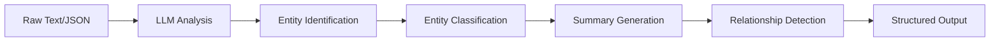

# Entity Extraction and Graph Building

## Overview

Entity extraction is the core NLP process that transforms unstructured text into structured knowledge graphs. This document details how Graphzep extracts entities, resolves them, and builds relationships.

## Entity Extraction Pipeline



## Entity Types

Graphzep recognizes and extracts various entity types:

### Core Entity Types

| Type | Description | Examples |
|------|-------------|----------|
| **Person** | Individual people | "Kamala Harris", "Elon Musk" |
| **Organization** | Companies, institutions | "OpenAI", "Stanford University" |
| **Place** | Locations, geographic entities | "San Francisco", "California" |
| **Concept** | Abstract ideas, roles | "Attorney General", "Machine Learning" |
| **Event** | Occurrences, happenings | "2024 Election", "Product Launch" |
| **Product** | Products, services | "GPT-4", "Tesla Model 3" |
| **Date** | Temporal references | "January 2024", "Q3 2023" |

### Custom Entity Types

Applications can define custom entity types:

```typescript
interface CustomEntity extends EntityNode {
  entityType: 'Document' | 'Project' | 'Metric' | 'Custom';
  customFields?: Record<string, any>;
}
```

## Extraction Process

### 1. LLM-Based Extraction

The extraction uses a carefully crafted prompt:

```typescript
private async extractEntitiesAndRelations(content: string): Promise<ExtractedData> {
  const prompt = `
    Extract entities and their relationships from the following text.
    
    Instructions:
    1. Identify all entities (people, places, organizations, concepts, etc.)
    2. For each entity, provide:
       - name: The entity's name (exact as mentioned)
       - entityType: The category (Person/Place/Organization/Concept/etc.)
       - summary: Brief description based on context (1-2 sentences)
    
    3. Identify relationships between entities
    4. For each relationship, provide:
       - sourceName: Name of the source entity
       - targetName: Name of the target entity
       - relationName: Nature of the relationship (verb phrase)
    
    Guidelines:
    - Use consistent naming (same name for same entity)
    - Make summaries informative but concise
    - Relationships should be directional and meaningful
    - Extract implicit relationships when clear from context
    
    Text: ${content}
  `;
  
  return await this.llmClient.generateStructuredResponse(prompt, ExtractionSchema);
}
```

### 2. Schema Validation

Using Zod for type-safe validation:

```typescript
const ExtractedEntitySchema = z.object({
  name: z.string().min(1).max(200),
  entityType: z.string().min(1).max(50),
  summary: z.string().min(1).max(500)
});

const ExtractedRelationSchema = z.object({
  sourceName: z.string().min(1).max(200),
  targetName: z.string().min(1).max(200),
  relationName: z.string().min(1).max(100)
});

const ExtractionResultSchema = z.object({
  entities: z.array(ExtractedEntitySchema),
  relations: z.array(ExtractedRelationSchema)
});
```

### 3. Example Extraction

**Input Text:**
```
"Kamala Harris served as the Attorney General of California from 2011 to 2017. 
Before that, she was the District Attorney of San Francisco. She worked closely 
with Governor Jerry Brown on criminal justice reform initiatives."
```

**Extracted Output:**
```json
{
  "entities": [
    {
      "name": "Kamala Harris",
      "entityType": "Person",
      "summary": "Former Attorney General of California who previously served as District Attorney of San Francisco"
    },
    {
      "name": "California",
      "entityType": "Place",
      "summary": "U.S. state where Kamala Harris served as Attorney General"
    },
    {
      "name": "San Francisco",
      "entityType": "Place",
      "summary": "City in California where Kamala Harris was District Attorney"
    },
    {
      "name": "Attorney General",
      "entityType": "Role",
      "summary": "Chief law enforcement officer of the state"
    },
    {
      "name": "District Attorney",
      "entityType": "Role",
      "summary": "Chief prosecutor for a local jurisdiction"
    },
    {
      "name": "Jerry Brown",
      "entityType": "Person",
      "summary": "Governor of California who worked with Harris on criminal justice reform"
    }
  ],
  "relations": [
    {
      "sourceName": "Kamala Harris",
      "targetName": "Attorney General",
      "relationName": "served as"
    },
    {
      "sourceName": "Kamala Harris",
      "targetName": "California",
      "relationName": "was Attorney General of"
    },
    {
      "sourceName": "Kamala Harris",
      "targetName": "District Attorney",
      "relationName": "previously served as"
    },
    {
      "sourceName": "Kamala Harris",
      "targetName": "San Francisco",
      "relationName": "was District Attorney of"
    },
    {
      "sourceName": "Kamala Harris",
      "targetName": "Jerry Brown",
      "relationName": "worked with"
    },
    {
      "sourceName": "Jerry Brown",
      "targetName": "California",
      "relationName": "was Governor of"
    }
  ]
}
```

## Entity Resolution

### Resolution Strategy

Entity resolution prevents duplicate entities in the graph:

```typescript
private async findExistingEntity(
  name: string, 
  groupId: string
): Promise<EntityNodeImpl | null> {
  // Exact match query
  const exactMatch = await this.driver.executeQuery<any[]>(
    `
    MATCH (n:Entity {name: $name, groupId: $groupId})
    RETURN n LIMIT 1
    `,
    { name, groupId }
  );
  
  if (exactMatch.length > 0) {
    return new EntityNodeImpl(exactMatch[0].n);
  }
  
  // Fuzzy matching for similar names
  const fuzzyMatches = await this.findSimilarEntities(name, groupId);
  
  if (fuzzyMatches.length > 0) {
    // Use similarity threshold
    const bestMatch = fuzzyMatches[0];
    if (bestMatch.similarity > 0.85) {
      return bestMatch.entity;
    }
  }
  
  return null;
}
```

### Similarity Matching

For fuzzy entity matching:

```typescript
private async findSimilarEntities(
  name: string,
  groupId: string,
  threshold: number = 0.85
): Promise<SimilarityMatch[]> {
  // Generate embedding for the name
  const nameEmbedding = await this.embedder.embed(name);
  
  // Find similar entities by embedding
  const query = `
    MATCH (n:Entity)
    WHERE n.groupId = $groupId
      AND n.summaryEmbedding IS NOT NULL
    WITH n, 
      reduce(similarity = 0.0, i IN range(0, size(n.summaryEmbedding)-1) | 
        similarity + (n.summaryEmbedding[i] * $embedding[i])
      ) AS similarity
    WHERE similarity > $threshold
    ORDER BY similarity DESC
    LIMIT 5
    RETURN n, similarity
  `;
  
  const results = await this.driver.executeQuery(query, {
    groupId,
    embedding: nameEmbedding,
    threshold
  });
  
  // Additional string similarity check
  return results.map(r => ({
    entity: new EntityNodeImpl(r.n),
    similarity: this.calculateStringSimilarity(name, r.n.name) * r.similarity
  }));
}
```

### Merge Strategy

When entities are determined to be the same:

```typescript
private async mergeEntities(
  existing: EntityNode,
  newInfo: ExtractedEntity
): Promise<EntityNode> {
  // Update summary if new information is more detailed
  if (newInfo.summary.length > existing.summary.length) {
    existing.summary = this.combineSummaries(existing.summary, newInfo.summary);
    existing.summaryEmbedding = await this.embedder.embed(existing.summary);
  }
  
  // Update entity type if more specific
  if (this.isMoreSpecific(newInfo.entityType, existing.entityType)) {
    existing.entityType = newInfo.entityType;
  }
  
  // Add temporal information
  existing.lastUpdated = new Date();
  
  await existing.save(this.driver);
  return existing;
}
```

## Relationship Extraction

### Relationship Types

Common relationship patterns extracted:

| Pattern | Description | Example |
|---------|-------------|---------|
| **Role** | Person holds position | "serves as", "works as" |
| **Location** | Entity at place | "located in", "based in" |
| **Ownership** | Possession relationship | "owns", "founded by" |
| **Association** | General connection | "associated with", "member of" |
| **Temporal** | Time-based relation | "succeeded by", "preceded by" |
| **Hierarchical** | Parent-child relation | "subsidiary of", "department of" |

### Relationship Processing

```typescript
private async processExtractedRelations(
  relations: ExtractedRelation[],
  entities: EntityNodeImpl[],
  groupId: string,
  episodeId: string
): Promise<EntityEdge[]> {
  const processedEdges: EntityEdge[] = [];
  
  for (const relation of relations) {
    // Find source and target entities
    const source = entities.find(e => e.name === relation.sourceName);
    const target = entities.find(e => e.name === relation.targetName);
    
    if (!source || !target) {
      console.warn(`Entities not found for relation: ${relation.sourceName} -> ${relation.targetName}`);
      continue;
    }
    
    // Check for existing relationship
    const existing = await this.findExistingRelation(
      source.uuid,
      target.uuid,
      relation.relationName
    );
    
    if (existing) {
      // Add episode to existing relationship
      existing.episodeIds.push(episodeId);
      await existing.save(this.driver);
      processedEdges.push(existing);
    } else {
      // Create new relationship
      const fact = this.generateFact(source, target, relation);
      const factEmbedding = await this.embedder.embed(fact);
      
      const edge = new EntityEdgeImpl({
        uuid: generateUUID(),
        sourceName: source.name,
        targetName: target.name,
        relationName: relation.relationName,
        fact: fact,
        factEmbedding: factEmbedding,
        episodeIds: [episodeId],
        validAt: new Date(),
        groupId: groupId,
        createdAt: new Date()
      });
      
      await edge.save(this.driver);
      processedEdges.push(edge);
    }
  }
  
  return processedEdges;
}
```

### Fact Generation

Creating human-readable facts from relationships:

```typescript
private generateFact(
  source: EntityNode,
  target: EntityNode,
  relation: ExtractedRelation
): string {
  // Template-based fact generation
  const templates = {
    'serves as': `${source.name} serves as ${target.name}`,
    'located in': `${source.name} is located in ${target.name}`,
    'works for': `${source.name} works for ${target.name}`,
    'founded': `${source.name} founded ${target.name}`,
    'owns': `${source.name} owns ${target.name}`
  };
  
  // Use template if available
  if (templates[relation.relationName]) {
    return templates[relation.relationName];
  }
  
  // Default format
  return `${source.name} ${relation.relationName} ${target.name}`;
}
```

## Graph Building

### Node Creation

```cypher
// Create Entity Node
MERGE (n:Entity {uuid: $uuid})
SET n.name = $name,
    n.entityType = $entityType,
    n.summary = $summary,
    n.summaryEmbedding = $summaryEmbedding,
    n.embedding = $summaryEmbedding,  // For search
    n.groupId = $groupId,
    n.createdAt = datetime($createdAt)
RETURN n
```

### Edge Creation

```cypher
// Create Relationship Edge
MATCH (s:Entity {uuid: $sourceId}), (t:Entity {uuid: $targetId})
CREATE (s)-[r:RELATES_TO {
  uuid: $uuid,
  name: $relationName,
  fact: $fact,
  factEmbedding: $factEmbedding,
  episodeIds: $episodeIds,
  validAt: datetime($validAt),
  groupId: $groupId
}]->(t)
RETURN r
```

### Episode Linking

```cypher
// Link Episode to Entities
MATCH (e:Episodic {uuid: $episodeId}), (n:Entity {uuid: $entityId})
CREATE (e)-[:MENTIONS]->(n)
```

## Advanced Extraction Features

### Co-reference Resolution

Handling pronouns and references:

```typescript
private async resolveCoReferences(text: string): Promise<string> {
  // Use LLM to resolve co-references
  const prompt = `
    Resolve all pronouns and co-references in the following text.
    Replace pronouns with the full names they refer to.
    
    Text: ${text}
  `;
  
  return await this.llmClient.generateResponse(prompt);
}
```

### Nested Entity Extraction

Handling complex nested structures:

```typescript
interface NestedEntity {
  entity: ExtractedEntity;
  children: NestedEntity[];
  parentRelation?: string;
}

private extractNestedEntities(content: string): NestedEntity[] {
  // Extract hierarchical structures
  // e.g., "OpenAI, which owns ChatGPT and DALL-E..."
  // Creates parent-child relationships
}
```

### Temporal Information Extraction

Extracting time-related information:

```typescript
private extractTemporalInfo(text: string): TemporalInfo[] {
  // Extract dates and time periods
  const datePattern = /(\d{4}[-/]\d{2}[-/]\d{2})|(\w+ \d{1,2}, \d{4})/g;
  const periodPattern = /from (\d{4}) to (\d{4})/g;
  
  // Associate temporal info with entities and facts
  return extractedDates.map(date => ({
    date: parseDate(date),
    context: getDateContext(text, date),
    entities: getRelatedEntities(date)
  }));
}
```

## Quality Assurance

### Validation Rules

```typescript
class ExtractionValidator {
  validate(extraction: ExtractedData): ValidationResult {
    const errors = [];
    
    // Entity validation
    for (const entity of extraction.entities) {
      if (entity.name.length < 2) {
        errors.push(`Entity name too short: ${entity.name}`);
      }
      if (!this.isValidEntityType(entity.entityType)) {
        errors.push(`Invalid entity type: ${entity.entityType}`);
      }
    }
    
    // Relationship validation
    for (const relation of extraction.relations) {
      const sourceExists = extraction.entities.some(e => e.name === relation.sourceName);
      const targetExists = extraction.entities.some(e => e.name === relation.targetName);
      
      if (!sourceExists || !targetExists) {
        errors.push(`Relationship references non-existent entity`);
      }
    }
    
    return {
      valid: errors.length === 0,
      errors
    };
  }
}
```

### Extraction Metrics

Monitor extraction quality:

```typescript
interface ExtractionMetrics {
  totalEntities: number;
  uniqueEntities: number;
  totalRelations: number;
  averageEntityNameLength: number;
  averageSummaryLength: number;
  entityTypes: Record<string, number>;
  relationTypes: Record<string, number>;
}

function calculateMetrics(extraction: ExtractedData): ExtractionMetrics {
  return {
    totalEntities: extraction.entities.length,
    uniqueEntities: new Set(extraction.entities.map(e => e.name)).size,
    totalRelations: extraction.relations.length,
    // ... calculate other metrics
  };
}
```