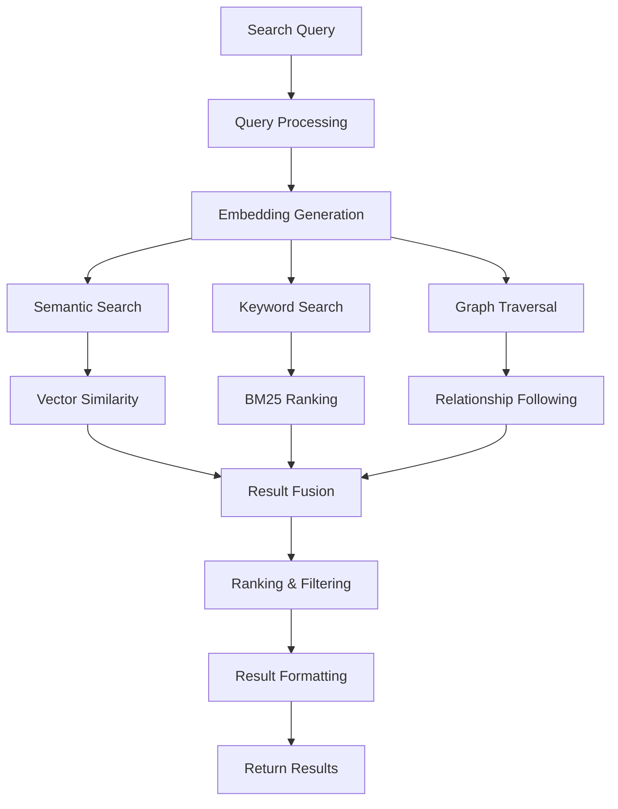

# Search and Retrieval

## Overview

Graphzep implements a sophisticated hybrid search system that combines semantic similarity, keyword matching, and graph traversal to provide accurate and contextual search results.

## Search Architecture



## Search Types

### 1. Semantic Search

Vector-based similarity search using embeddings:

```typescript
async semanticSearch(params: SearchParams): Promise<Node[]> {
  // Generate query embedding
  const queryEmbedding = await this.embedder.embed(params.query);
  
  // Cypher query for cosine similarity
  const query = `
    MATCH (n)
    WHERE n.groupId = $groupId
      AND (n:Entity OR n:Episodic OR n:Community)
      AND n.embedding IS NOT NULL
    WITH n, 
      reduce(similarity = 0.0, i IN range(0, size(n.embedding)-1) | 
        similarity + (n.embedding[i] * $embedding[i])
      ) AS similarity
    WHERE similarity > $threshold
    ORDER BY similarity DESC
    LIMIT $limit
    RETURN n, labels(n) as labels, similarity
  `;
  
  const results = await this.driver.executeQuery(query, {
    groupId: params.groupId,
    embedding: queryEmbedding,
    threshold: params.threshold || 0.7,
    limit: params.limit || 10
  });
  
  return this.processSearchResults(results);
}
```

#### Cosine Similarity Calculation

```typescript
function cosineSimilarity(vec1: number[], vec2: number[]): number {
  let dotProduct = 0;
  let norm1 = 0;
  let norm2 = 0;
  
  for (let i = 0; i < vec1.length; i++) {
    dotProduct += vec1[i] * vec2[i];
    norm1 += vec1[i] * vec1[i];
    norm2 += vec2[i] * vec2[i];
  }
  
  return dotProduct / (Math.sqrt(norm1) * Math.sqrt(norm2));
}
```

### 2. Keyword Search (BM25)

Full-text search with BM25 ranking:

```typescript
async keywordSearch(params: SearchParams): Promise<Node[]> {
  // Create full-text index if not exists
  await this.createFullTextIndex();
  
  // BM25 search query
  const query = `
    CALL db.index.fulltext.queryNodes('contentIndex', $query)
    YIELD node, score
    WHERE node.groupId = $groupId
    RETURN node, labels(node) as labels, score
    ORDER BY score DESC
    LIMIT $limit
  `;
  
  const results = await this.driver.executeQuery(query, {
    query: params.query,
    groupId: params.groupId,
    limit: params.limit || 10
  });
  
  return this.processSearchResults(results);
}
```

#### Full-Text Index Creation

```cypher
CREATE FULLTEXT INDEX contentIndex IF NOT EXISTS
FOR (n:Entity|Episodic|Community)
ON EACH [n.name, n.summary, n.content]
```

### 3. Graph Traversal Search

Follow relationships to expand search context:

```typescript
async graphTraversalSearch(params: SearchParams): Promise<Node[]> {
  // First, find seed nodes
  const seedNodes = await this.semanticSearch({
    ...params,
    limit: 5
  });
  
  // Expand through relationships
  const query = `
    MATCH (seed)
    WHERE seed.uuid IN $seedIds
    MATCH (seed)-[r:RELATES_TO*1..2]-(related)
    WHERE related.groupId = $groupId
    WITH related, 
         count(DISTINCT seed) as connections,
         avg(r.strength) as avgStrength
    ORDER BY connections DESC, avgStrength DESC
    LIMIT $limit
    RETURN related, labels(related) as labels
  `;
  
  const seedIds = seedNodes.map(n => n.uuid);
  const results = await this.driver.executeQuery(query, {
    seedIds,
    groupId: params.groupId,
    limit: params.limit || 10
  });
  
  return this.processSearchResults(results);
}
```

### 4. Hybrid Search

Combines multiple search strategies:

```typescript
async hybridSearch(params: SearchParams): Promise<Node[]> {
  const [semanticResults, keywordResults, graphResults] = await Promise.all([
    this.semanticSearch(params),
    this.keywordSearch(params),
    this.graphTraversalSearch(params)
  ]);
  
  // Merge and rank results
  const mergedResults = this.mergeSearchResults(
    semanticResults,
    keywordResults,
    graphResults,
    params.weights || { semantic: 0.5, keyword: 0.3, graph: 0.2 }
  );
  
  return mergedResults.slice(0, params.limit || 10);
}
```

## Search Parameters

### SearchParams Interface

```typescript
interface SearchParams {
  query: string;                    // Search query text
  groupId?: string;                 // Data isolation group
  limit?: number;                   // Max results (default: 10)
  nodeTypes?: string[];            // Filter by node types
  edgeTypes?: string[];            // Filter by edge types
  threshold?: number;              // Similarity threshold (0-1)
  dateRange?: {                   // Temporal filtering
    start?: Date;
    end?: Date;
  };
  weights?: {                      // Hybrid search weights
    semantic?: number;
    keyword?: number;
    graph?: number;
  };
  includeMetadata?: boolean;       // Include extra metadata
}
```

### Advanced Search Options

```typescript
interface AdvancedSearchParams extends SearchParams {
  filters?: {
    entityTypes?: string[];        // Filter by entity types
    hasRelations?: boolean;        // Only entities with relations
    minConnections?: number;       // Minimum graph connections
  };
  expansion?: {
    depth?: number;                // Graph traversal depth
    maxNodes?: number;             // Max nodes to explore
    relationTypes?: string[];      // Specific relations to follow
  };
  ranking?: {
    algorithm?: 'cosine' | 'euclidean' | 'manhattan';
    boostFactors?: Record<string, number>;
  };
}
```

## Query Processing

### 1. Query Analysis

Understand query intent and structure:

```typescript
async analyzeQuery(query: string): Promise<QueryAnalysis> {
  const analysis = {
    intent: 'search',              // search, question, command
    entities: [],                  // Detected entities
    keywords: [],                  // Important terms
    temporal: null,               // Time references
    filters: {}                   // Implied filters
  };
  
  // Extract entities from query
  const entityPattern = /["']([^"']+)["']/g;
  const matches = query.matchAll(entityPattern);
  for (const match of matches) {
    analysis.entities.push(match[1]);
  }
  
  // Detect temporal references
  const timePattern = /(last|past|recent|current|between|from|to|in \d{4})/i;
  if (timePattern.test(query)) {
    analysis.temporal = this.parseTemporalQuery(query);
  }
  
  // Identify query type
  if (query.startsWith('who') || query.startsWith('what')) {
    analysis.intent = 'question';
  }
  
  return analysis;
}
```

### 2. Query Expansion

Enhance queries for better results:

```typescript
async expandQuery(query: string): Promise<string[]> {
  // Synonym expansion
  const synonyms = await this.getSynonyms(query);
  
  // Stemming and lemmatization
  const stems = this.stemWords(query);
  
  // Related terms via embeddings
  const relatedTerms = await this.findRelatedTerms(query);
  
  return [query, ...synonyms, ...stems, ...relatedTerms];
}
```

## Result Processing

### 1. Result Merging

Combine results from multiple search methods:

```typescript
private mergeSearchResults(
  semantic: SearchResult[],
  keyword: SearchResult[],
  graph: SearchResult[],
  weights: SearchWeights
): SearchResult[] {
  const merged = new Map<string, MergedResult>();
  
  // Add semantic results
  semantic.forEach((result, index) => {
    const score = (1 - index / semantic.length) * weights.semantic;
    merged.set(result.uuid, {
      ...result,
      score,
      sources: ['semantic']
    });
  });
  
  // Add keyword results
  keyword.forEach((result, index) => {
    const score = (1 - index / keyword.length) * weights.keyword;
    if (merged.has(result.uuid)) {
      const existing = merged.get(result.uuid);
      existing.score += score;
      existing.sources.push('keyword');
    } else {
      merged.set(result.uuid, {
        ...result,
        score,
        sources: ['keyword']
      });
    }
  });
  
  // Add graph results
  graph.forEach((result, index) => {
    const score = (1 - index / graph.length) * weights.graph;
    if (merged.has(result.uuid)) {
      const existing = merged.get(result.uuid);
      existing.score += score;
      existing.sources.push('graph');
    } else {
      merged.set(result.uuid, {
        ...result,
        score,
        sources: ['graph']
      });
    }
  });
  
  // Sort by combined score
  return Array.from(merged.values())
    .sort((a, b) => b.score - a.score);
}
```

### 2. Result Ranking

Advanced ranking algorithms:

```typescript
class ResultRanker {
  rank(results: SearchResult[], query: string): RankedResult[] {
    return results.map(result => {
      const score = this.calculateScore(result, query);
      return { ...result, finalScore: score };
    }).sort((a, b) => b.finalScore - a.finalScore);
  }
  
  private calculateScore(result: SearchResult, query: string): number {
    let score = result.baseScore || 0;
    
    // Boost for exact matches
    if (result.name?.toLowerCase() === query.toLowerCase()) {
      score *= 2;
    }
    
    // Boost for entity type relevance
    if (result.entityType === 'Person' && query.includes('who')) {
      score *= 1.5;
    }
    
    // Boost for recency
    const daysSinceCreation = (Date.now() - result.createdAt) / (1000 * 60 * 60 * 24);
    score *= Math.exp(-daysSinceCreation / 30); // Decay over 30 days
    
    // Boost for connectivity
    if (result.connectionCount > 10) {
      score *= 1.2;
    }
    
    return score;
  }
}
```

### 3. Result Formatting

Format results for presentation:

```typescript
interface FormattedResult {
  uuid: string;
  type: 'entity' | 'episode' | 'fact';
  title: string;
  summary: string;
  relevance: number;
  metadata: {
    entityType?: string;
    createdAt: Date;
    connections?: number;
    sources?: string[];
  };
  highlight?: {
    title?: string;
    summary?: string;
  };
}

function formatSearchResults(results: Node[]): FormattedResult[] {
  return results.map(node => {
    if ('entityType' in node) {
      return {
        uuid: node.uuid,
        type: 'entity',
        title: node.name,
        summary: node.summary || 'No description available',
        relevance: node.score || 0,
        metadata: {
          entityType: node.entityType,
          createdAt: node.createdAt,
          connections: node.connectionCount
        }
      };
    } else if ('episodeType' in node) {
      return {
        uuid: node.uuid,
        type: 'episode',
        title: node.name || node.content.substring(0, 50),
        summary: node.content.substring(0, 200),
        relevance: node.score || 0,
        metadata: {
          createdAt: node.createdAt
        }
      };
    }
    // Handle other node types...
  });
}
```

## Specialized Searches

### 1. Temporal Search

Search within time ranges:

```typescript
async temporalSearch(params: TemporalSearchParams): Promise<Node[]> {
  const query = `
    MATCH (n)
    WHERE n.groupId = $groupId
      AND n.validAt >= datetime($startDate)
      AND (n.invalidAt IS NULL OR n.invalidAt <= datetime($endDate))
    OPTIONAL MATCH (n)-[r]-(related)
    WHERE r.validAt >= datetime($startDate)
      AND (r.invalidAt IS NULL OR r.invalidAt <= datetime($endDate))
    WITH n, collect(DISTINCT related) as connections
    RETURN n, labels(n) as labels, size(connections) as connectionCount
    ORDER BY n.validAt DESC
    LIMIT $limit
  `;
  
  return await this.driver.executeQuery(query, {
    groupId: params.groupId,
    startDate: params.dateRange.start.toISOString(),
    endDate: params.dateRange.end.toISOString(),
    limit: params.limit || 10
  });
}
```

### 2. Entity-Centric Search

Find all information about specific entities:

```typescript
async entityCentricSearch(entityName: string, groupId: string): Promise<EntityContext> {
  // Get the entity
  const entity = await this.findEntity(entityName, groupId);
  
  if (!entity) {
    return null;
  }
  
  // Get all relationships
  const relations = await this.getEntityRelations(entity.uuid);
  
  // Get all episodes mentioning the entity
  const episodes = await this.getEntityEpisodes(entity.uuid);
  
  // Get temporal evolution
  const timeline = await this.getEntityTimeline(entity.uuid);
  
  return {
    entity,
    relations,
    episodes,
    timeline,
    summary: await this.generateEntitySummary(entity, relations, episodes)
  };
}
```

### 3. Path Finding

Find connections between entities:

```typescript
async findPath(source: string, target: string, groupId: string): Promise<Path[]> {
  const query = `
    MATCH (s:Entity {name: $source, groupId: $groupId}),
          (t:Entity {name: $target, groupId: $groupId})
    MATCH path = shortestPath((s)-[*..5]-(t))
    RETURN path, 
           [n in nodes(path) | labels(n)] as nodeLabels,
           [r in relationships(path) | type(r)] as relTypes
    LIMIT 5
  `;
  
  const results = await this.driver.executeQuery(query, {
    source,
    target,
    groupId
  });
  
  return results.map(r => this.parsePath(r.path));
}
```

## Search Optimization

### 1. Index Management

```cypher
// Create indices for performance
CREATE INDEX entity_name IF NOT EXISTS FOR (n:Entity) ON (n.name);
CREATE INDEX entity_group IF NOT EXISTS FOR (n:Entity) ON (n.groupId);
CREATE INDEX entity_embedding IF NOT EXISTS FOR (n:Entity) ON (n.embedding);
CREATE INDEX episode_content IF NOT EXISTS FOR (n:Episodic) ON (n.content);
CREATE INDEX temporal_valid IF NOT EXISTS FOR (n:Entity) ON (n.validAt);
```

### 2. Query Optimization

```typescript
class QueryOptimizer {
  optimize(query: string, params: SearchParams): OptimizedQuery {
    // Use index hints
    if (params.nodeTypes?.length === 1) {
      query = query.replace('MATCH (n)', `MATCH (n:${params.nodeTypes[0]})`);
    }
    
    // Limit early when possible
    if (!params.includeMetadata) {
      query = query.replace('RETURN n', 'WITH n LIMIT $limit RETURN n');
    }
    
    // Use parallel runtime for complex queries
    if (this.isComplexQuery(query)) {
      query = `CYPHER runtime=parallel ${query}`;
    }
    
    return { query, params };
  }
}
```

### 3. Caching Strategy

```typescript
class SearchCache {
  private cache = new LRUCache<string, SearchResult[]>(1000);
  
  async get(params: SearchParams): Promise<SearchResult[] | null> {
    const key = this.generateCacheKey(params);
    return this.cache.get(key);
  }
  
  async set(params: SearchParams, results: SearchResult[]): Promise<void> {
    const key = this.generateCacheKey(params);
    this.cache.set(key, results, { ttl: 300000 }); // 5 minutes
  }
  
  private generateCacheKey(params: SearchParams): string {
    return crypto.createHash('sha256')
      .update(JSON.stringify(params))
      .digest('hex');
  }
}
```

## Search Analytics

### Tracking Search Performance

```typescript
interface SearchMetrics {
  query: string;
  executionTime: number;
  resultCount: number;
  searchType: string;
  cacheHit: boolean;
  userSatisfaction?: number;
}

class SearchAnalytics {
  async track(metrics: SearchMetrics): Promise<void> {
    // Store metrics for analysis
    await this.store.save({
      ...metrics,
      timestamp: new Date(),
      sessionId: this.sessionId
    });
    
    // Update aggregates
    await this.updateAggregates(metrics);
  }
  
  async getPopularQueries(limit: number = 10): Promise<string[]> {
    return await this.store.getTopQueries(limit);
  }
  
  async getAverageResponseTime(): Promise<number> {
    return await this.store.getAverageMetric('executionTime');
  }
}
```