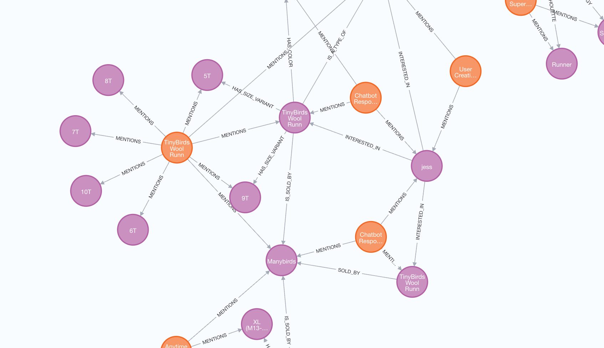

# SheBot Sales Agent - LangGraph + Graphzep Example

This example demonstrates building a conversational sales agent using TypeScript, Graphzep for knowledge persistence, and a simplified agent architecture inspired by LangGraph concepts.

## Overview

The SheBot Sales Agent showcases:
- **Persistent Knowledge**: Conversations and product data stored in Graphzep knowledge graph
- **Context-Aware Responses**: Personalized responses based on conversation history
- **Product Database Integration**: Real-time queries against shoe product catalog
- **Sales-Focused Interaction**: Designed to gather customer preferences and close sales

## Features

### Core Functionality
- ✅ **Product Data Ingestion**: Loads shoe catalog into Graphzep graph
- ✅ **User Node Creation**: Creates persistent user profiles
- ✅ **Context Retrieval**: Searches conversation history for relevant facts
- ✅ **Product Search Tool**: Queries product database for shoe information
- ✅ **Conversation Persistence**: Saves all interactions to knowledge graph

### Sales Agent Capabilities
The agent is designed to discover:
- Customer's shoe size
- Foot type requirements (wide feet, etc.)
- Preferred colors and styles
- Budget constraints
- Specific use cases (running, casual, athletic)

## Prerequisites

- Node.js 18+
- TypeScript
- Neo4j database running
- Environment variables configured:
  ```bash
  OPENAI_API_KEY=your_openai_api_key
  NEO4J_URI=bolt://localhost:7687
  NEO4J_USER=neo4j
  NEO4J_PASSWORD=password
  ```

## Installation

```bash
cd examples/langgraph-agent
npm install
```

## Usage

### Run Test Interaction

```bash
npx tsx agent.ts
```

This will:
1. Initialize the agent and load product data
2. Create a user node for "jess"
3. Run a test interaction about TinyBirds Wool Runners
4. Display the agent's response

### Interactive Chat Mode

Uncomment the `runInteractiveChat()` line in the main function to enable interactive chat:

```typescript
// await agent.runInteractiveChat();
```

Then run:
```bash
npx tsx agent.ts
```

Type your messages and the agent will respond. Type `quit` or `exit` to end the conversation.

## Architecture

### Agent Components

1. **ShoeBotAgent Class**: Main agent orchestration
2. **Product Data Ingestion**: Loads shoe catalog into Graphzep
3. **User Management**: Creates and manages user profiles
4. **Context Retrieval**: Searches Graphzep for relevant conversation facts
5. **Response Generation**: Produces sales-focused responses
6. **Knowledge Persistence**: Saves interactions to graph

### Data Flow

```
User Input → Context Retrieval → Product Search → Response Generation → Knowledge Persistence
     ↓                ↑                 ↓                    ↓                      ↓
Conversation      Graphzep         Shoe Database      Sales Response         Updated Graph
   State           Search            Query              Generation              State
```

### Knowledge Graph Structure

The agent creates several types of nodes and relationships:

**Nodes:**
- **User Nodes**: Customer profiles (e.g., "jess")
- **Product Nodes**: Shoe catalog items
- **Conversation Nodes**: Chat interactions
- **Company Node**: ManyBirds brand entity

**Relationships:**
- User `INTERESTED_IN` Product
- User `HAS_PREFERENCE` for colors/styles
- Product `AVAILABLE_IN` sizes/colors
- Conversation `MENTIONS` products/preferences

## Example Interactions

### Basic Product Query
```
User: What sizes do the TinyBirds Wool Runners in Natural Black come in?
SalesBot: Great choice! Our TinyBirds Wool Runners are very popular. They come in 
sizes 7-12 and are available in Natural Black and Natural Grey. They're $95 and 
perfect for casual wear or light running. What size are you looking for?
```

### Size Discovery
```
User: I'm looking for running shoes
SalesBot: Excellent! We have some great running options. What's your shoe size? 
Our shoes typically run true to size, and we have sizes ranging from 6 to 13 
depending on the model. Do you have any special fit requirements like wide feet?
```

### Preference Learning
```
User: I prefer darker colors
SalesBot: Perfect! We have several shoes in darker colors including Natural Black, 
Navy, and Forest Green. What type of shoes are you looking for - running, casual, 
or athletic? And what size do you wear?
```

## Customization

### Adding New Products

Add products to the sample data in the `ingestProductsData()` method:

```typescript
const sampleProducts: Product[] = [
  {
    title: 'Your New Shoe Model',
    description: 'Description of the shoe',
    price: 99,
    category: 'Running',
    sizes: ['7', '8', '9', '10'],
    colors: ['Black', 'White'],
  },
  // ... more products
];
```

### Customizing Sales Logic

Modify the response generation in `generateResponse()` to change the sales approach:

```typescript
// Add new conversation patterns
if (userInput.toLowerCase().includes('budget')) {
  response = "What's your budget for shoes? We have great options at different price points...";
}
```

### Extending Graph Schema

Add new entity types and relationships by modifying the episode metadata:

```typescript
await this.graphzep.addEpisode({
  content: episodeContent,
  metadata: {
    // Add custom metadata for new entity types
    entityTypes: ['Preference', 'Size', 'Color'],
    relationships: ['PREFERS', 'WEARS', 'LIKES'],
  },
});
```

## Integration with LangGraph (Future Enhancement)

This example provides a foundation that could be extended with full LangGraph integration:

```typescript
// Future LangGraph integration example
import { StateGraph, MemorySaver } from 'langgraph';

class LangGraphSheBot extends ShoeBotAgent {
  private graph: StateGraph;
  private memory: MemorySaver;
  
  async initializeLangGraph() {
    // Set up LangGraph with tools and memory
    this.memory = new MemorySaver();
    this.graph = new StateGraph(AgentState);
    
    // Add nodes and edges
    this.graph.addNode('agent', this.chatbot);
    this.graph.addNode('tools', this.toolNode);
    
    // Compile graph with checkpointer
    this.graph = this.graph.compile({ checkpointer: this.memory });
  }
}
```

## Visualization

The knowledge graph structure can be visualized in Neo4j Desktop. After running the agent, you'll see nodes representing:
- User (jess) connected to products they're interested in
- Product catalog with detailed specifications
- Conversation history with timestamps and context



## Development

### Running in Development Mode

```bash
# Install dependencies
npm install

# Run with TypeScript watching
npx tsx watch agent.ts

# Build for production
npx tsc
```

### Testing

```bash
# Run the test interaction
npx tsx agent.ts

# Test specific functionality
node -e "
const { ShoeBotAgent } = require('./dist/agent.js');
const agent = new ShoeBotAgent();
agent.initialize().then(() => agent.runTestInteraction());
"
```

## Troubleshooting

### Common Issues

1. **Neo4j Connection Error**: Verify Neo4j is running and credentials are correct
2. **Missing OpenAI Key**: Set `OPENAI_API_KEY` environment variable
3. **Product Data Loading**: Ensure `../data/manybirds_products.json` exists or use sample data
4. **Memory Usage**: Large product catalogs may require Neo4j memory tuning

### Performance Optimization

- **Batch Product Loading**: Load products in batches for large catalogs
- **Caching**: Implement response caching for common queries
- **Index Optimization**: Use proper Neo4j indexing for faster searches

## Next Steps

1. **Full LangGraph Integration**: Add complete LangGraph state management
2. **Tool Enhancement**: Add more sophisticated product search tools
3. **Multi-turn Conversations**: Improve context handling across multiple turns
4. **Recommendation Engine**: Add ML-based product recommendations
5. **Order Processing**: Integrate with e-commerce platform for actual sales

This example provides a solid foundation for building production-ready conversational commerce agents with persistent knowledge and context-aware responses.